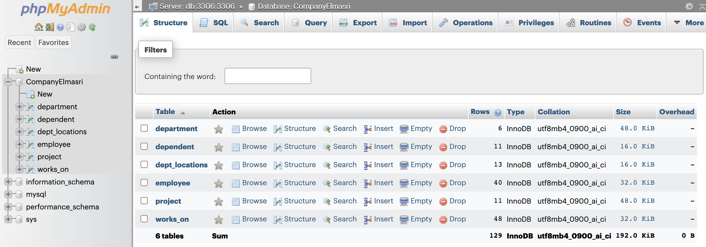
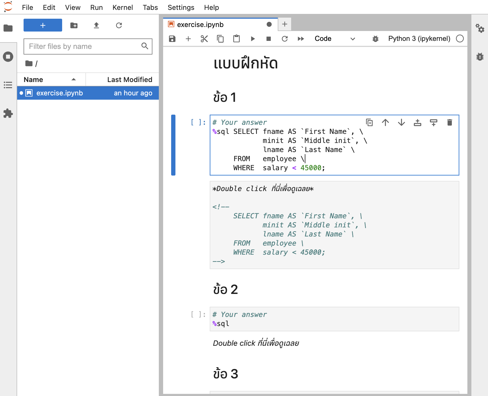

# What is this repository about?

This is a Git repository used for materials related to my CSCMU course: 204321, 
Database Systems. In the beginning, this was supposed to be used on my own. 
Then I found it to be useful for all of my colleagues, so I decided to open 
this repository to the public. Feel free to send me pull requests if I made 
some mistakes.

# Contents

- [MySQL Docker Server](#user-content-heading-mysql-docker-server)
- [FAQs](#user-content-faq)

<a name="heading-mysql-docker-server"></a>
## MySQL Docker Server

This is a Docker compose application that let you run MySQL, Phpmyadmin, and 
Jupyter Lab, with no or few configurations.

For Jupyter Lab, this is a complement tool to do the practices more easily.

### Setup

1. Download and install [Docker](https://docs.docker.com/get-started/).
2. Make sure to switch to directory `mysql-docker-server`. The root directory 
of this repository may be occupied for other purposes in the future.
3. Run `docker compose up -d` to start the server.

That's all. Simple, isn't it?

At first, it takes some time to install related dependencies, but it will take 
much slower later.

**To shutdown the server,** run `docker compose down` in the same directory as 
before.

### How to use?

#### Phpmyadmin 

Start the server and browse `http://localhost:8080` on a web browser.

You will notice that the database `CompanyElmasri` has been already imported.



#### Jupyter Lab (Doing the practice)

Start the server and browse `http://localhost:8888` on a web browser. 

On the left pane, there will be the only file named `exercise.ipynb`. This file 
provides the answers for all the 26 problems.

In case you want to get your modified file, it is located in 
`mysql-docker-server/sql-notebooks`.

***Don't forget to save the file before exit Jupyter Lab.***



### 

<a name="faq"></a>
## Probable FAQs

Nobody has asked me yet, so I guess my own set of Q&A's.

1. **How can I connect to MySQL using Jupyter Lab?**<br>Read the practice 
notebook.

2. **How can I reset the database to the default state?**<br>There may be a
moment that you will modify the database (i.e. using `DELETE`, `INSERT`, `UPDATE`).
Just run:
```shell
cd mysql-docker-server
rm -r data-volume
```

